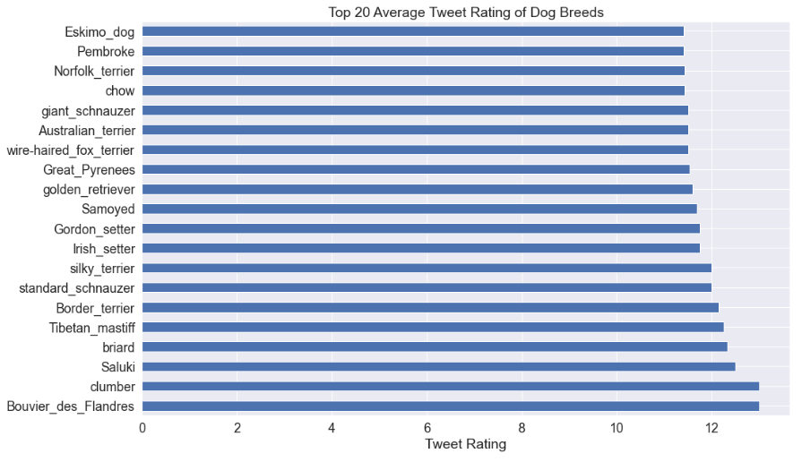
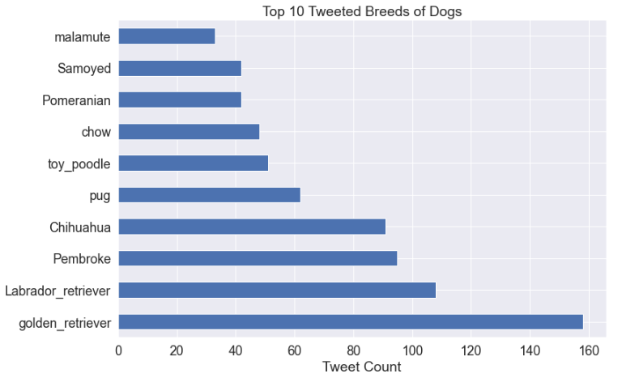
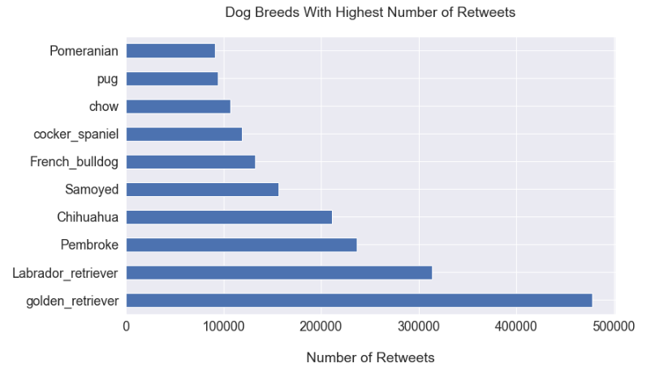
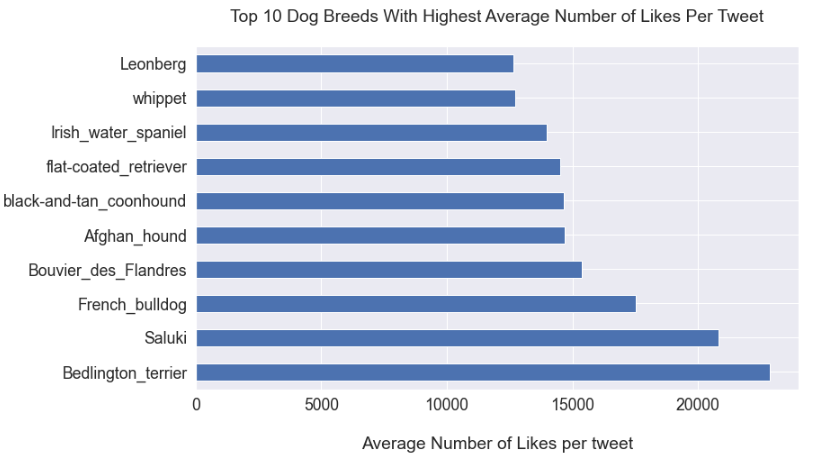

# DATA ANALYSIS ON WERATEDOGS (@dog_rates) TWITTER HANDLE
## BY AGU, JAMES IFEANYICHUKWU

# INTRODUCTION
This report is based on the analysis carried out on the WeRateDogs tweets which is part
of the Udacity Nanodegree Data Wrangling project. The datasets were provided by
Udacity, but some information needed for the analysis, like favorites and retweet count
were not available on the dataset. We had to use Web-Scraping via the Twitter Tweepy
API. Our analyses were based on tweets on or before 2017.

### About WERATEDOGS (@dog_rates)

**WeRateDogs**, also known as @dog_rates, is a Twitter account created in 2015 by college
student, Matt Nelson with the aim of rating people's dogs with humorous comments
about the dogs. Over time, the account received international media attention for its
popularity, but also drew attention based on the social media copyright law breach which
led to suspension of the account on the 9th of February, 2016. This suspension was as a
result of a DMCA claim filed by an unknown person with alleged email account,
Myteenquote123@gmail.com which Matt confirmed he received. The account was
restored on Wednesday, 10th February 2016 after Matt Nelson wrote to twitter explaining
the impersonation and the unfounded claims.

### Questions for Analysis

We would be answering the following questions based on our analysis:
1. Which dog breed has the highest ratings?
2. Among the Dog Breeds, which top 10 were tweeted most?
3. Which dog breed recorded the highest retweet count?
4. Which dog breed has the highest number of likes on average?

## ROADMAP
During the data wrangling process, a number of steps were undertaken in order to get the
data ready for analysis.
The entire data wrangling process was done using the Jupyter Notebook.
The data wrangling steps are listed below:
1. Data Gathering
2. Assessing Data
3. Cleaning Data
4. Storing Data

## DATA GATHERING
There were three datasets for our analysis and three separate methods were taken to
download each of them.
The first method was to directly download the twitter_archive_enhanced.csv dataset
and manually load it using the pandas read_csv object. This dataset contained over
5000+ datasets of
The second method was using the Requests library to download the image_prediction
dataset from the website url provided.
The third and final method using the Tweepy library to query the remaining dataset
(tweet_json.txt) through the Twitter API. The returned result was in JSON format, and
this result was saved to our directory for further assessment and analysis.

## ASSESSING DATA
This process involved both manual and programmatic assessment of our datasets.
We leveraged the Pandas library functions for the programmatic assessment. The functions used were DataFrame.info(), DataFrame.describe(), DataFrame.head(), etc.
The matplotlib library was useful for visualization of the datasets in order to draw
more insights on relationships among the columns.
We also checked our datasets for both Quality and Tidiness issues.
Quality issues are those relating to the content of our datasets which include missing
data, invalid data, inaccurate date or inconsistent data.
Tidiness issues on the other hand, refers to structure of our data (columns, rows or
table). We were able to observe about 8 quality issues and 2 Tidiness issues on our
datasets. After the assessment, the three datasets were merged into a single column
for further analysis.

## CLEANING DATA
This step was all about cleaning our dataset based on all of the issues observed
during the assessment stage. The cleaning process involved changing datatypes,
dropping columns and rows that would not be useful, replacing or dropping missing
rows/columns, correcting spelling errors, collapsing columns of similar features into
a single column.

## STORING DATA
At the end of the cleaning process, the cleaned data was saved and stored as
twitter_archive_master.csv for exploratory and explanatory data analysis.

## EXPLANATORY ANALYSIS

#### Question 1: Which dog breed has the highest ratings?

• Bourvier Des Flandres and Clumber recorded the highest average tweet rating
with an average tweet rating of 13, followed by Saluki with average tweet rating
of 12.5.
• We can also conclude that Bouvier Des Flandres, Clumber, Saluki, Briard, and
Tibetan Mastiff are top 5 rated dog breeds.

### Question 2: Among the Dog Breeds, which top 10 were tweeted most?

• The visualization shows the Top 10 Tweeted Dog Breeds.
• We can conclude that Golden Retriever is the most tweeted Dog Breed 158 tweet counts, followed by Labrador Retriever with Tweet count of 108.
• It appears Golden Retriever is the most popular breed of dog in homes.

### Question 3: Which dog breed recorded the highest retweet count?

• Golden Retriever remains the most retweeted dog breed with total retweet count of 477,396 retweets, followed by Labrador Retriever with retweet count of 313,615.

### Question 4: Which dog breed has the highest number of likes on average?

• We can conclude that Bedlington Terrier has the highest average number of likes per tweet compared to other dog breeds.
• It appears Bedlington Terrier has the most humorous display and audience engagement which led to its highest number of likes every time it was tweeted.

# CONCLUSION:
We can conclude that based on number, Golden Retriever is most popular dog breed in homes, while Berlington Terrier has the highest audience vote.

## References
[Weratedogs-wikipedia](https://en.wikipedia.org/wiki/WeRateDogs)

[dailydot](https://www.dailydot.com/debug/twitter-dog-rates-dmca-takedown/)

[vice](https://www.vice.com/en/article/aekvg8/twitter-rate-dogs-account-suspended)
